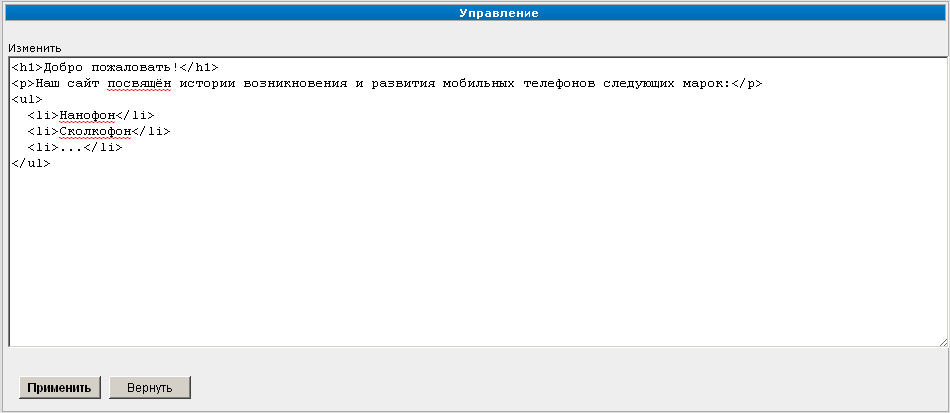

По умолчанию
============

Это самый простой тип раздела. Он позволяет создавать страницы с произвольной разметкой HTML.

После завершения ввода / редактирования информации следует подтвердить внесение изменений нажатием
кнопки "Применить" либо отказаться от операции нажатием кнопки "Вернуть".
