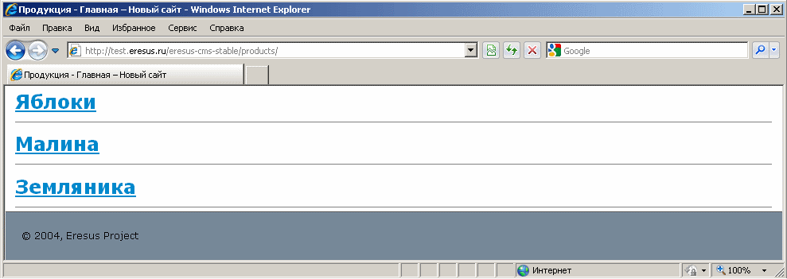
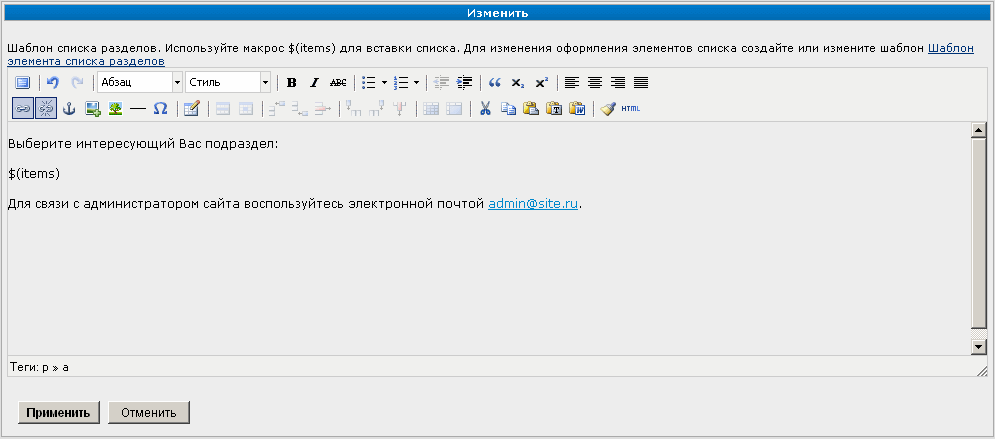
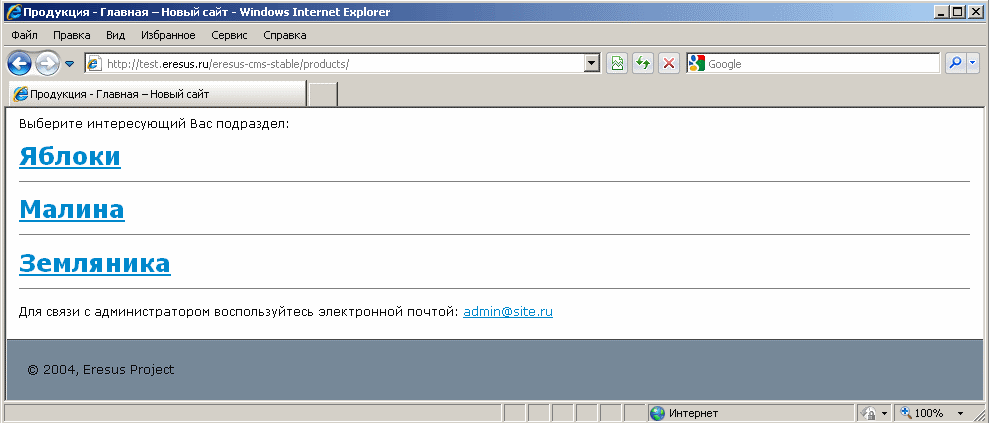

Список подразделов
==================

Этот тип раздела позволяет создавать на сайте страницы, со списком подразделов.

Предположим, что Вы хотите создать на вашем сайте следующую структуру разделов:

* Главная
* Продукция

 * Яблоки
 * Малина
 * Земляника

При этом Вы хотите чтобы в разделе "Продукция" выводился автоматически обновляемый список её подразделов (в нашем случае это "Яблоки", "Малина" и "Земляника").

Для этого создайте раздел "Продукция" и укажите для него тип "Список подразделов". После этого создайте подразделы "Яблоки", "Малина" и "Земляника".

Если теперь открыть в клиентском интерфейса сайта раздел "Продукция", то вы увидите примерно следующее:

Так же вы можете добавить на страницу произвольный текст и изменить внешний вид списка.

Для управления текстом следует при помощи меню :doc:`Контент <../ui/menu-content>` перейти в раздел "Продукция". Будет показан такой диалог:

Это диалог позволяет разместить любую текстографическую информацию, используя :doc:`визуальный редактор <../ui/wysiwyg>`.

.. important::
   Если Вы внесли текст, то обязательно вставьте макрос ``$(items)``, чтобы указать где должен выводиться список подразделов. Если этого не сделать, то список выводиться не будет!

Для пользователя данная страница будет выглядеть следующим образом:

