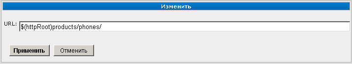

URL
===

Тип раздела «URL» используется для того, чтобы разместить в списке разделов ссылку. Указанная ссылка может вести на любой сайт в Интернете либо на любую внутреннюю страницу (метку) данного сайта.

При вводе ссылки на внутренний источник можно использовать :doc:`макросы <../appendix/macros>`.

После завершения ввода / редактирования адреса следует подтвердить внесение изменений нажатием кнопки «Применить» либо отказаться от операции нажатием кнопки «Отменить».

