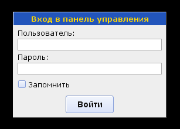

Вход в административный интерфейс
=================================

Для входа в систему необходимо с помощью браузера зайти по адресу:

**http://ваш_сайт/admin/**

Вы увидите окно авторизации, в котором надо указать своё имя пользователя и пароль:

.. hint::
   При первом входе в систему используйте имя пользователя "root" и пустой пароль.

.. attention::
   Обязательно смените пароль для пользователя "root"! Как это сделать см в разделе [[cms:admin-guide:site:users:index|]].

Если вы установите галку "Запомнить", то имя и пароль будут сохранены в [[wpru>cookie]] и система не будет больше запрашивать пароль при входе через этот браузер.

.. caution::
   Не рекомендуется использование этой возможности, если вашим компьютером под одной учетной записью пользуется несколько людей.

.. note::
   Во избежание взлома системы перебором паролей, после неудачной попытки авторизации, следующая может быть предпринята не ранее, чем через количество секунд равное количеству предыдущих неудачных попыток.
