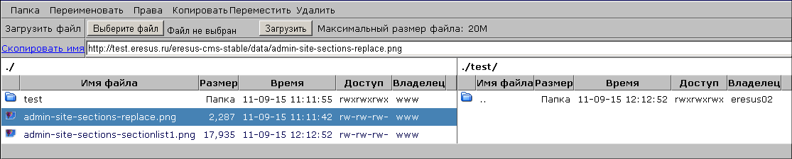

Файловый менеджер
=================

Файловый менеджер позволяет осуществлять следующие действия с файлами и каталогами:

* загружать файлы на сайт и просматривать их;
* переименовывать файлы;
* копировать и перемещать файлы в другие каталоги;
* удалять файлы;
* создавать каталоги;
* переименовывать каталоги файлов;
* копировать и перемещать каталоги;
* управлять правами доступа к файлам и каталогам;
* удалять каталоги.

Для перехода к файловому менеджеру выберите пункт "Файловый менеджер" :doc:`меню "Управление" <../ui/menu-control>`.

Окно файлового менеджера состоит из панели управления и двух рабочих полей. Каждое рабочее поле отображает содержимое выбранного каталога, а также адресную строку, в которой указывается путь к этому каталогу. Корневым каталогом для размещения файлов сайта является каталог «data», его наименование отображается в адресной строке как «.».

Для выбора рабочего поля, в котором будет производиться управление файлами или каталогами, установите курсор мыши в требуемое рабочее поле.

Для каждого файла и каталога, содержащегося в любом рабочем поле, отображается следующая информация:

* иконка, визуально отображающая расширение файла или каталога;
* «Имя файла» --- имя и расширение файла или каталога;
* «Размер» --- размер файла либо слово «Папка» для каталога;
* «Время» --- дата и время добавления файла или каталога;
* «Доступ» --- сведения о правах доступа пользователей к файлу;
* «Владелец» --- имя пользователя, добавившего файл или каталог.

Для перехода к содержимому каталога дважды нажмите левую кнопку мыши на строке с его названием. Для перехода к родительскому каталогу дважды нажмите левую кнопку мыши на строке с изображением каталога и именем файла «..».

Загрузка файлов
---------------

Для загрузки файлов выберите в рабочем поле требуемый каталог и нажмите кнопку «Выберите файл». При этом откроется стандартное окно проводника, в котором необходимо выбрать добавляемый файл. После выбора файла следует нажать кнопку «Загрузить». При успешной загрузке добавленный файл отобразится в выбранном рабочем поле.

Для того чтобы получить адрес файла, выделите требуемую строку в списке файлов и нажмите кнопку «Скопировать имя». После этого URL файла будет скопировано в буфер обмена.

Для просмотра файла дважды нажмите левую кнопку мыши на строке с его названием. При этом файл будет загружен для просмотра.

Изменение имени файла
---------------------

Для изменения имени файла выберите требуемую строку в списке файлов и нажмите кнопку «Переименовать». При этом будет вызван диалог, в котором необходимо отредактировать имя файла.

Копирование или перемещение файла в другой каталог
--------------------------------------------------

Копирование файла в другой каталог осуществляется следующим образом:

#. В любом рабочем окне выберите каталог, в который будет производиться копирование.
#. Выберите требуемый файл в другом рабочем окне.
#. Нажмите кнопку «Копировать».

После этого требуемый файл будет скопирован в требуемый каталог.

Процедура перемещения файла в другой каталог производится аналогично процедуре копирования за исключением того, что для этого используется кнопка «Переместить».

Удаление файла
--------------

Для удаления файла выберите требуемую строку в списке файлов и нажмите кнопку «Удалить». При этом будет вызвано окно подтверждения операции.

Добавление каталога
-------------------

Для добавления каталога выберите требуемый родительский каталог и нажмите кнопку «Папка». При этом будет вызван диалог, в котором необходимо указать имя добавляемой папки. После подтверждения ввода добавленный каталог будет отображен в требуемом рабочем поле.

Изменение имени каталога
------------------------

Для изменения имени каталога выберите требуемую строку каталога и нажмите кнопку «Переименовать». Процедура изменения имени каталога производится аналогично процедуре изменения имени файла.

.. attention::
   После переименования каталога будут изменены адреса файлов, содержащихся в этом каталоге. Исправьте на сайте адреса файлов во избежание проблем с доступом к данным файлам.

Копирование/перемещение файлового каталога
------------------------------------------

Процедуры копирования и перемещения файлового каталога производятся аналогично процедурам копирования и перемещения файлов.

.. attention::
   После перемещения каталога будут изменены адреса файлов, содержащихся в этом каталоге. Исправьте на сайте адреса файлов во избежание проблем с доступом к данным файлам.

Управление правами доступа к файлу или каталогу
-----------------------------------------------

Хранение файлов и файловых каталогов производится на серверах, предоставляющих файловые услуги систем UNIX. Права доступа пользователей к файлам и файловым каталогам устанавливаются в соответствии с синтаксисом системы UNIX.

Для изменения прав доступа пользователей к файлу или каталогу выберите требуемую строку в списке и нажмите кнопку «Права». В открывшемся диалоге укажите код прав доступа к файлу.

.. warning::
   Не изменяйте настройки прав доступа пользователей без необходимости!

Удаление каталога
-----------------

Процедура удаления каталога производится алогично процедуре удаления файла.

.. attention::
   При удалении каталога происходит удаление всех содержащихся в нем файлов!
