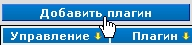
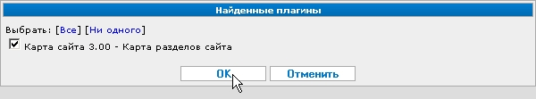

Установка
=========

Скопируйте файлы плагина в директорию ``/ext/``.

.. tip::
   Допустим, ваш сайт расположен в директории ``/home/user/public_html/``. Тогда полный путь к директории ``/ext/`` будет таким: ``/home/user/public_html/ext/``.

   Допустим так же, что вы хотите установить модуль расширения "Карта сайта", состоящий из файла ''sitemap.php'' и директории ''sitemap''.

   В этом случае вам надо скопировать файл ''sitemap.php'' и директорию ''sitemap'' в  ''/home/user/public_html/ext/''

Зайдите в административный интерфейс и в меню :doc:`меню "Управление" <../../ui/menu-control>` выберите "Модули расширения".

Нажмите кнопку **«Добавить плагин»**:

Установите чекбокс напротив названия устанавливаемого модуля:

Нажмите "ОК".

Модуль расширения установлен.
