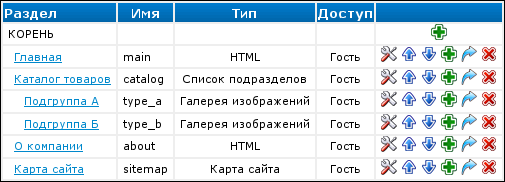
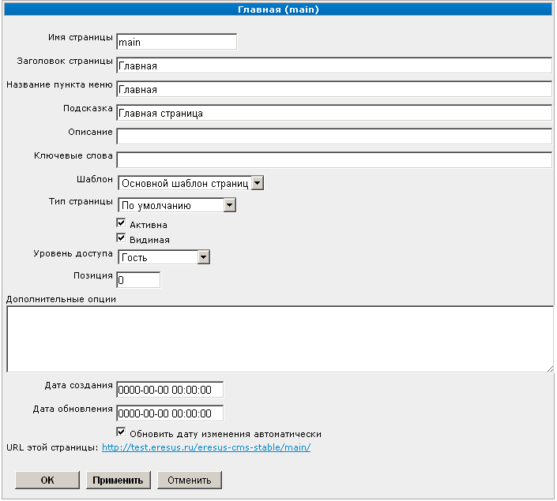
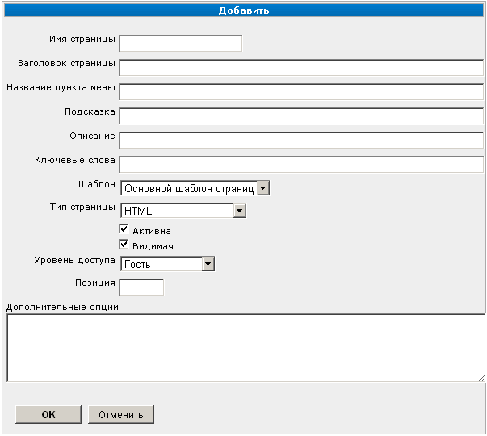
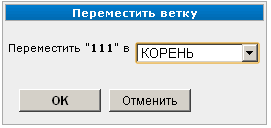

Управление разделами сайта
==========================

Попасть в управление разделами можно через пункт "Разделы сайта"
:doc:`меню "Управление" <../../ui/menu-control>`.

Список разделов
---------------

При входе в "Разделы сайта" вам будет показано дерево существующих разделов сайта:

Здесь вы можете использовать следующие элементы управления:

+----------------------------+----------------------------------------------------------+
| Значок                     | Описание                                                 |
+============================+==========================================================+
| .. image:: item-config.png | Изменить :ref:`свойства раздела <properties>`            |
+----------------------------+----------------------------------------------------------+
| .. image:: item-add.png    | :ref:`Добавить новый подраздел в выбранный раздел <add>` |
+----------------------------+----------------------------------------------------------+
| .. image:: move-up.png     | :ref:`Поднять или опустить раздел в списке <position>`   |
| .. image:: move-down.png   |                                                          |
+----------------------------+----------------------------------------------------------+
| .. image:: item-move.png   | :ref:`Переместить подраздел в другой раздел <move>`      |
+----------------------------+----------------------------------------------------------+
| .. image:: item-delete.png | :ref:`Удалить раздел <delete>`                           |
+----------------------------+----------------------------------------------------------+

.. _properties:

Свойства раздела
----------------

Для изменения свойств раздела выберите требуемую запись в списке разделов и нажмите кнопку

.. image:: item-config.png

в соответствующей строке. При этом будет показана страница, содержащая свойства раздела.

В заголовке страницы отображается название раздела. Полный адрес страницы раздела указан в нижней
части окна под заголовком "URL этой страницы:".

При настройке по умолчанию поля свойств раздела имеют следующие значения:

Имя страницы
  значение, которое используется в адресе страницы сайта;

Заголовок страницы
  заголовок страницы сайта. Обычно используется для тега ``<title>``. Доступен в шаблонах через
  свойство ``{$page->title}``. Подробнее об управлении заголовками страниц см. :doc:`../meta-tags`;

Название пункта меню
  название, которое обычно используется для отображения в меню данного раздела. Доступно в шаблонах
  через свойство ``{$page->caption}``. Это зависит от используемых для вывода меню модулей
  расширения и их настроек (пример такого модуля: `<http://docs.eresus.ru/cms-plugins/menus/index>`_);

Подсказка
  обычно используется как текст всплывающей подсказки. Доступно в шаблонах через свойство
  ``{$page->hint}``. Подробнее об управлении мета-тегами см. :doc:`../meta-tags`;

Описание
  доступно в шаблонах через свойство ``{$page->description}``. Подробнее об управлении мета-тегами
  см. :doc:`../meta-tags`;

Ключевые слова
  доступны в шаблонах через свойство ``{$page->keywords}``. Подробнее об управлении мета-тегами см.
  :doc:`../meta-tags`.

Для выбора шаблона страницы используйте выпадающий список "Шаблон".

Для выбора типа страницы используйте выпадающий список "Тип страницы".

Для того чтобы сделать раздел недоступным пользователям без удаления самого раздела, снимите
галочку "Активна". При установке галочки "Активна" страница вновь будет доступна.

Для того чтобы раздел был доступен пользователям, но не отображался в меню, снимите галочку "Видимая".
При установке этой галочки раздел вновь будет отображаться в меню.

Для выбора уровня доступа пользователей к странице используйте выпадающий список "Уровень доступа".

Поле "Позиция" содержит :ref:`порядковый номер раздела <position>`, в соответствии с которым
производится сортировка разделов в меню.

Поле "Дополнительные опции" предназначено для ввода дополнительных опций для модулей расширения.

Дата создания и дата обновления раздела отображаются в соответствующих полях. При необходимости
можно скорректировать эти значения вручную. Для автоматического изменения даты обновления установите
галочку "Обновить дату изменения  автоматически".

Для сохранения изменений и дальнейшего перехода к списку разделов нажмите кнопку "ОК". Для того
чтобы сохранить изменения и остаться на данной странице нажмите кнопку "Применить". Для отказа от
сохранения изменений нажмите кнопку "Отменить".

.. _add:

Добавление раздела
------------------

Для добавления раздела выберите требуемый корневой каталог в списке разделов и нажмите кнопку

.. image:: item-add.png

в соответствующей строке. При этом будет показана страница добавления раздела:

Процедура заполнения полей при создании раздела производится аналогично процедуре заполнения полей при :ref:`редактировании свойств раздела <properties>`.

Для сохранения раздела с указанными свойствами в выбранном корневом каталоге нажмите кнопку "ОК". Для отказа от добавления раздела нажмите кнопку "Отменить".

.. _position:

Изменение порядка следования разделов в меню
--------------------------------------------

Для изменения порядка следования разделов в меню выберите требуемую запись в списке разделов и нажмите кнопку

.. image:: move-up.png

или

.. image:: move-down.png

в соответствующей строке. При этом позиция данного раздела будет изменена соответствующим образом.

Также для изменения порядкового номера раздела можно изменить значение свойства "Позиция" при :ref:`редактировании свойств раздела <position>`.

.. _move:

Перемещение подраздела в другой раздел
--------------------------------------

Для перемещения подраздела в другой раздел выберите требуемую запись в списке разделов и нажмите кнопку

.. image:: item-move.png

При этом будет показана страница перемещения подраздела.

Выберите новый родительский каталог в выпадающем списке.

Для сохранения изменений нажмите кнопку "ОК", для отказа от операции --- кнопку "Отменить".

.. _delete:

Удаление раздела
----------------

Для удаления раздела выберите требуемую запись в списке разделов и нажмите кнопку

.. image:: item-delete.png

При этом будет показано окно подтверждения операции.

Если раздел содержит подразделы, они будут удалены автоматически.
