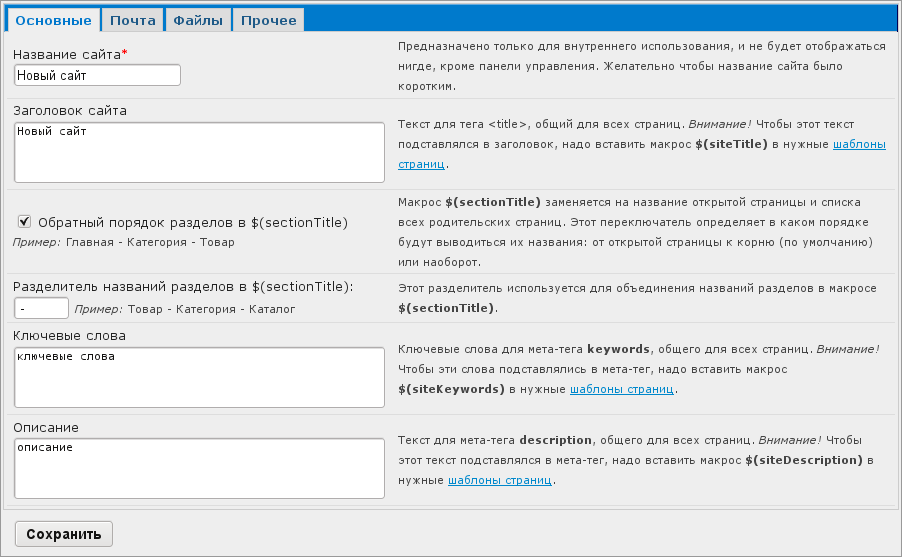
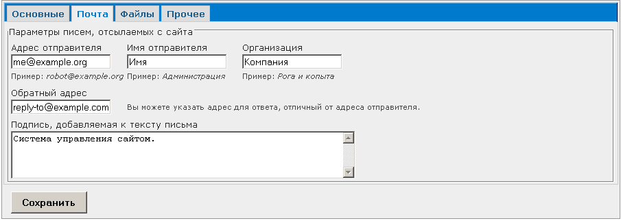
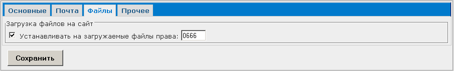
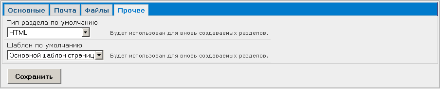

Конфигурация
============

Попасть в этот раздел можно через пункт "Конфигурация" :doc:`меню "Управление" <../ui/menu-control>`.

Раздел "Конфигурация" содержит четыре вкладки:

* :ref:`Основные <main>` --- управление основными настройками сайта;
* :ref:`Почта <mail>` --- управление настройками почты, рассылаемых с сайта;
* :ref:`Файлы <files>` --- настройка конфигурации файлов, загружаемых на сайт;
* :ref:`Прочее <misc>` --- установка типа раздела и шаблона, предлагаемых по умолчанию.

После настройки конфигурации подтвердите операцию нажатием кнопки "Сохранить". Для отказа от
внесения изменений выйдите из раздела "Конфигурация".

.. _main:

Основное
--------

Основные настройки сайта.

Название сайта
^^^^^^^^^^^^^^

Короткое название сайта. Используется только в :doc:`АИ </manage/intro/terms>` (например, в диалоге
авторизации).

Доступно в шаблонах через переменную ``{$site->name}``.

Заголовок сайта
^^^^^^^^^^^^^^^

Общая часть заголовка страниц сайта. Обычно используется для тега ``<title>``.

Доступен в шаблонах через переменную ``{$site->title}``. Подробнее об управлении заголовками страниц
см. :doc:`meta-tags`.

Вывод разделов в обратном порядке
^^^^^^^^^^^^^^^^^^^^^^^^^^^^^^^^^

Флаг используется для определения, в каком порядке будет выводиться полный путь от корневого раздела
к странице. Для вывода пути в обратном порядке установите галочку "Обратный порядок разделов в
$(sectionTitle)".

Разделитель
^^^^^^^^^^^

В поле "Разделитель" указывается символ, который разделяет название раздела и списка всех
родительских страниц.

Используется в макросе ``$(sectionTitle)``. Подробнее об управлении заголовками страниц см.
:doc:`meta-tags`.

Ключевые слова
^^^^^^^^^^^^^^

Глобальный (общий для всех страниц) список ключевых слов сайта для использования в мета-тегах.

Доступны в шаблонах через переменную ``{$site->keywords}``.

Подробнее об управлении мета-тегами см. :doc:`meta-tags`.

Описание сайта
^^^^^^^^^^^^^^

Глобальное (общее для всех страниц) описание сайта для использования в мета-тегах.

Доступно в шаблонах через переменную ``{$site->description}``.

Подробнее об управлении мета-тегами см. :doc:`meta-tags`.

.. _mail:

Почта
-----

Для настройки параметров писем, рассылаемых с сайта, перейдите на вкладку "Почта".

В качестве обратного адреса можно указать значение, не совпадающее с адресом отправителя.

.. _files:

Файлы
-----

Для настройки конфигурации файлов, загружаемых на сайт, перейдите на вкладку «Файлы».

В данной вкладке можно установить права доступа на загружаемые файлы.

.. warning::
   Не изменяйте настройки прав доступа пользователей без необходимости!

.. _misc:

Прочее
------

На вкладке "Прочее" устанавливаются тип раздела и шаблон, которые по умолчанию будут предлагаться при создании раздела.

Выберите тип раздела и шаблон из соответствующих выпадающих списков.
