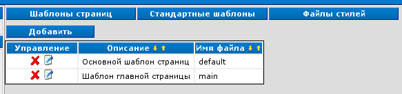

Оформление
==========

Попасть в этот раздел можно через пункт "Оформление" :doc:`меню "Управление" <../ui/menu-control>`.

Шаблоны страниц
---------------

.. tip::
   Эти шаблоны можно править не только через веб-интерфейс. Они располагаются в папке ``templates``.

Стандартные шаблоны
-------------------

.. tip::
   Эти файлы можно править не только через веб-интерфейс. Они располагаются в папке ``templates/std``.

Файлы стилей
------------

.. tip::
   Эти шаблоны можно править не только через веб-интерфейс. Они располагаются в папке ``style``.

