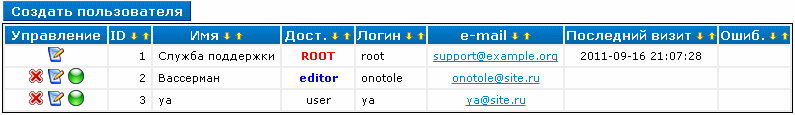
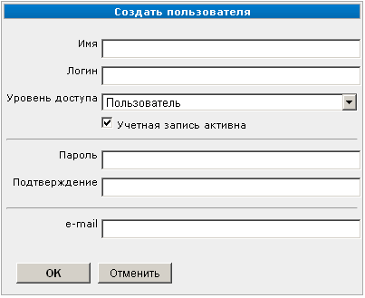
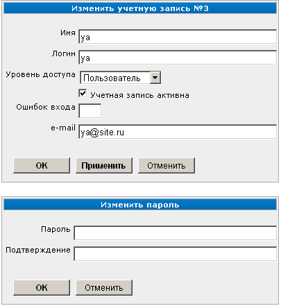

Пользователи
============

Попасть в управление профилями пользователей можно через пункт «Пользователи»
:doc:`меню "Управление" <../ui/menu-control>`. При этом будет показан список профилей пользователей
сайта.

Добавление профиля пользователя
-------------------------------

Для добавления профиля пользователя нажмите кнопку "Создать пользователя". При этом будет показана
страница добавления профиля пользователя:

На данной странице заполните сведения о пользователе.

* Имя — имя, которое позволит определить, кому принадлежит эта учётная запись. Например "Олег Владимирович Степанов".
* Логин — краткое имя, которое будет использоваться для входа в систему. Например "oleg".
* Уровень доступа — определяет права пользователя. В CMS предусмотрены следующие уровни:

 * Пользователь — самый низкий уровень. Не имеет доступа в АИ. Нужен только для использования модулями расширения;
 * Редактор — имеет доступ к управлению наполнением сайта, но не к настройкам сайта;
 * Администратор — имеет доступ к управлению наполнением и настройкам сайта;
 * ROOT — суперпользователь, имеет все возможные права. Такой пользователь создаётся при установке, и вы не можете добавлять новых с таким уровнем доступа.

* Учётная запись активна — снятие галки позволяет временно отключить пользователю доступ.
* "Пароль" и "Подтверждение пароля" — пароль и подтверждение правильности его ввода. Значения в обоих полях должны совпадать.
* e-mail — адрес электронной почти пользователя.

Для подтверждения создания профиля пользователя нажмите кнопку "ОК", для отказа от операции --- кнопку "Отменить".

Изменение профиля и пароля пользователя
---------------------------------------

Для изменения профиля пользователя выберите в списке требуемую запись и нажмите кнопку «Изменить».
При этом будет показана страница изменения профиля пользователя:

Страница содержит два диалога:

* Изменение профиля пользователя.
* Изменение пароля пользователя.

В диалоге изменения профиля пользователя можно изменить сведения о пользователе. Также в поле
"Ошибок входа" отображается количество провалившихся попыток авторизации пользователя. При
необходимости можно отредактировать это значение.

Для изменения профиля пользователя введите новый пароль в диалоге изменения пароля. Значения в полях
"Пароль" и "Подтверждение пароля" должны совпадать.

Включение и отключение пользователя
-----------------------------------

Предусмотрена возможность управления активностью пользователя без удаления его профиля. Для
отключения выберите требуемую запись в списке профилей пользователей и нажмите кнопку «Удалить».
Для включения пользователя нажмите эту же кнопку повторно.

Также можно включить или отключить пользователя при добавлении и редактировании его профиля. Для
этого используется переключатель "Учетная запись активна".

Удаление профиля пользователя
-----------------------------

Для удаления профиля пользователя выберите требуемую строку в списке профилей и нажмите кнопку
«Удаление». При этом будет показано окно подтверждения операции.
