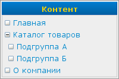

Меню «Контент»
==============

Меню "Контент" располагается в левой верхней части страницы:

Это меню предоставляет доступ к информационному наполнению разделов сайта: текстам, статьям, новостям, продуктам, галереям и т. д.

Структура меню соответствует структуре разделов сайта, управляемой через :doc:`разделы сайта <../site/sections/index>`.

Слева от каждого пункта расположен значок в виде квадратика:

+------------------------------------------+---------------------+-------------------------------------------------------------------------------------------------------+
| .. image:: admin-menu-content-empty.png  | Пустой квадратик    | У этого пункта нет подпунктов                                                                         |
+------------------------------------------+---------------------+-------------------------------------------------------------------------------------------------------+
| .. image:: admin-menu-content-closed.png | Квадратик с плюсом  | У этого пункта есть подпункты, которые сейчас **не** показаны. Клик мышью по значку покажет подпункты |
+------------------------------------------+---------------------+-------------------------------------------------------------------------------------------------------+
| .. image:: admin-menu-content-opened.png | Квадратик с минусом | У этого пункта есть подпункты, которые сейчас показаны. Клик мышью по значку скроет подпункты         |
+------------------------------------------+---------------------+-------------------------------------------------------------------------------------------------------+

Пункты, показанные серым цветом, соответствуют скрытым разделам. Подробнее см. :doc:`../site/sections/index`.

Кликнув по пункту вы попадёте на страницу редактирования содержимого выбранного раздела. Внешний вид и возможности этой страницы зависят от типа раздела. Описания страниц редактирования встроенных типов разделов даны в :doc:`Управлении контентом <../content/index>`.
