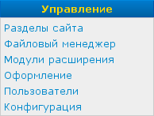

Меню «Управление»
=================

Меню «Управление» расположено в левой части страницы под :doc:`меню «Контент» <menu-content>`.

Меню содержит пункты:

* Разделы сайта — переход к :doc:`управлению разделами сайта <../site/sections>`
* Файловый менеджер — переход к :doc:`управлению файлами сайта <../site/file-manager>`
* Модули расширения — переход к :doc:`управлению модулями расширения <../site/plugins>`
* Оформление — переход к :doc:`управлению шаблонами и стилями <../site/markup>`
* Пользователи — переход к :doc:`управлению пользователей сайта <../site/users>`
* Конфигурация — переход к :doc:`управлению основными настройками сайта <../site/settings>`
