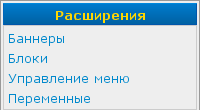

Меню «Расширения»
=================

Меню "Расширения" находится под :doc:`меню «Контент» <menu-content>`, и показывается только тогда, когда установлены расширения, добавляющие в него свои пункты.

Состав меню и назначение его пунктов зависят от установленных расширений. Подробнее можно прочитать в документации к конкретным расширениям.
