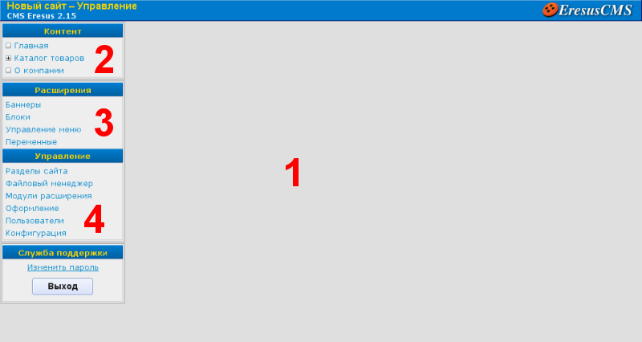
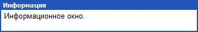
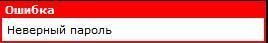
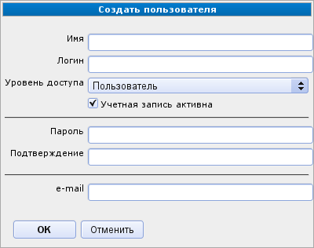
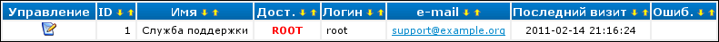

Обзор АИ
========

После успешной :doc:`авторизации </manage/intro/login>`, вы попадаете в интерфейс администратора (АИ), состоящий из четырех основных частей:

* Рабочее поле. Здесь отображаются списки, диалоги, окна и прочие управляющие элементы системы.
* :doc:`menu-content`. Предоставляет доступ к управлению информационным содержанием страниц сайта.
* :doc:`menu-plugins`. Предоставляет доступ к дополнительным функциям системы. Изначально меню "Расширения" отсутствует т. к. эти функции обеспечиваются модулями расширения.
* :doc:`menu-control`. Содержит список главных управляющих страниц системы. Предоставляет доступ к общим настройкам сайта, таким как учетные записи пользователей, шаблоны страниц, модули расширения, структура сайта.

Элементы интерфейса
-------------------

В рабочей области интерфейса есть три основных вида управляющих элементов: информационные окна, диалоги и списки.

Информационные сообщения
^^^^^^^^^^^^^^^^^^^^^^^^

Выводят некоторую информацию, не предполагающую каких-то действий со стороны администратора.

   Инофрмационное сообщение

   Сообщение об ошибке

Диалоги
^^^^^^^

Предназначены для ввода и изменения информации. Главными элементами диалоговых окон являются поля ввода, занимающие правую часть окна. Слева от каждого поля находится подпись, поясняющая его значение. Кроме того, некоторые подписи могут содержать дополнительные подсказки, отображаемые при наведении на них указателя мыши. В нижней части диалога могут располагаться следующие кнопки: «ОК» — принять изменения и вернуться к предыдущему окну; «Применить» — сохранить изменения и остаться в диалоге; «Отмена» — вернуться не сохраняя введенную информацию.

Списки
^^^^^^

Предоставляют средства для просмотра списков разнообразных элементов в удобном табличном виде. Каждый список состоит из трех областей: заголовков столбцов, столбца «Управление» и данных. Кроме того, над списком могут располагаться дополнительные элементы управления, например, кнопка добавления элемента в список.

Заголовок столбца
  Управляет сортировкой списка. Для этого в заголовке столбца имеются элементы управления в виде двух стрелочек. Левая стрелочка направлена вниз и устанавливает сортировку по данному полю в порядке возрастания значений элементов. Правая стрелочка направлена вверх и производит сортировку в порядке убывания. При этом поле, по которому на данный момент отсортирован список, подсвечивается желтым цветом вместо белого. Исключением является самая первая колонка - «Управление». В заголовке этой колонки есть только одна стрелочка (и только если для элементов списка может быть указана их позиция), которая сортирует элементы согласно заданной для каждого позиции.

Столбец "Управление"
  Предоставляет элементы управления, при помощи которых можно выполнить определённые действия для каждой позиции списка. Наборы могут различаться для разных позиций одного списка.

+------------------------------+----------------------------------------------------------------------------------------------------+
| .. image:: item-delete.png   | Удаляет элемент списка. Перед удалением будет запрошено подтверждение операции.                    |
+------------------------------+----------------------------------------------------------------------------------------------------+
| .. image:: item-edit.png     | Вызывает диалог изменения позиции списка.                                                          |
+------------------------------+----------------------------------------------------------------------------------------------------+
| .. image:: move-up.png       | Перемещает элемент вверх или вниз в списке. Доступен, только если включена сортировка «По порядку» |
| .. image:: move-down.png     |                                                                                                    |
+------------------------------+----------------------------------------------------------------------------------------------------+
| .. image:: item-active.png   | Отключить или включить элемент списка.                                                             |
| .. image:: item-inactive.png |                                                                                                    |
+------------------------------+----------------------------------------------------------------------------------------------------+

Данные
  Сведения об элементах списка.

Дополнительно, над списком могут располагаться кнопки, выполняющие другие действия, например, добавляющие элемент в список.
