Визуальный редактор
===================

Визуальный редактор может встречаться в тех местах, где требуется редактировать форматированный текст. Благодаря интерфейсу, похожему на популярные текстовые процессоры, такие как Microsoft Word или LibreOffice Writer, он позволяет создавать разметку HTML не имея специальных знаний в этой области.

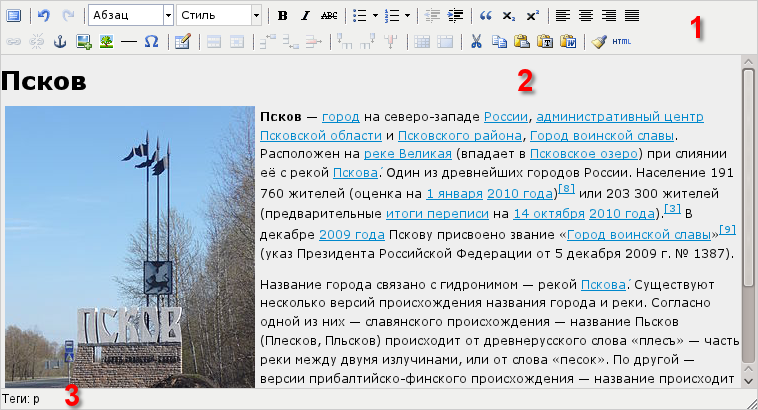

Визуальный редактор содержит панель инструментов (1), текстовое поле (2) и строку состояния (3).

Панель инструментов рассматривается в п. :ref:`Панель инструментов <toolbar>`.

Строка состояния отображает дополнительную информацию. Подробнее см. :ref:`Строка состояния <statusbar>`.

.. _toolbar:

Панель инструментов
-------------------

Панель инструментов содержит кнопки редактирования текста. При наведении курсора мыши на кнопку отображается всплывающая подсказка с наименованием кнопки и указанием "горячих клавиш" для выполнения данного действия. Назначение кнопок и выпадающих списков рассматривается ниже.

Полноэкранный режим
^^^^^^^^^^^^^^^^^^^

Кнопка позволяет развернуть окно редактора до размеров окна браузера. При повторном нажатии кнопки происходит возврат к обычному режиму отображения визуального редактора.

Отмена предыдущего действия
^^^^^^^^^^^^^^^^^^^^^^^^^^^

Отменяет последние действие, выполненное над текстом.

Возврат отмененного действия
^^^^^^^^^^^^^^^^^^^^^^^^^^^^

Возвращает действие, отменённое командой "Отмена предыдущего действия".

Формат
^^^^^^

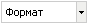

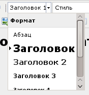

Выпадающий список используется для структурирования текста по уровням. Например, для оформления обычного текста используется формат "Абзац", для оформления заголовка 4-го уровня — "Заголовок 4".

Стиль
^^^^^

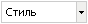

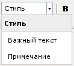

Выпадающий список используется для изменения внешнего вида выделенного текста путём выбора стиля. По умолчанию доступно два стиля:

* "Важный текст" — задаёт красный цвет для шрифта;
* "Примечание" — уменьшает размер шрифта [#f1]_ , а также делает его серым и наклонным.

Однако администратор сайта может задать :doc:`собственный список стилей </markup/tinymce-custom-styles>`.

Полужирный
^^^^^^^^^^

Делает выделенный текст **полужирным**. При повторном нажатии — отменяет жирность.

Курсив
^^^^^^

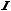

Делает выделенный текст *курсивным*. При повторном нажатии — отменяет курсив.

Зачёркнутый
^^^^^^^^^^^

Перечёркивает выделенный текст. При повторном нажатии — отменяет перечёркивание.

Маркированный список
^^^^^^^^^^^^^^^^^^^^

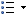

При нажатии данной кнопки текст форматируется как список, при этом каждая позиция списка отмечается значком. Для выбора формы значка вызовите выпадающий список нажатием на стрелочку:
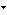

Управлять уровнем вложенности элементов списка можно при помощи кнопок :ref:`Уменьшить отступ <outdent>` и :ref:`Увеличить отступ <indent>`.

Нумерованный список
^^^^^^^^^^^^^^^^^^^

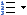

При нажатии данной кнопки текст форматируется как список, при этом каждая позиция списка отмечается соответствующим номером. Для выбора формата нумерации вызовите выпадающий список нажатием на стрелочку:

Управлять уровнем вложенности элементов списка можно при помощи кнопок :ref:`Уменьшить отступ <outdent>` и :ref:`Увеличить отступ <indent>`.

.. _outdent:

Уменьшить отступ
^^^^^^^^^^^^^^^^

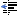

При нажатии данной кнопки уменьшается отступ текста от края страницы. Для списков уменьшается уровень вложенности.

.. _indent:

Увеличить отступ
^^^^^^^^^^^^^^^^

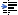

При нажатии данной кнопки увеличивается отступ текста от края страницы. Для списков увеличивается уровень вложенности.

Цитата
^^^^^^

При нажатии данной кнопки текст оформляется как цитата.

Нижний индекс
^^^^^^^^^^^^^

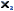

При нажатии данной кнопки текст переводится в нижний индекс. Например: X\ :sub:`2`.

Верхний индекс
^^^^^^^^^^^^^^

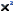

При нажатии данной кнопки текст переводится в верхний индекс. Например: X\ :sup:`2`.

Выравнивание текста
^^^^^^^^^^^^^^^^^^^

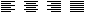

Кнопки задают выравнивание текста в абзаце соответственно по левому краю, центру, правому краю или по ширине.

Добавить / изменить ссылку
^^^^^^^^^^^^^^^^^^^^^^^^^^

Добавляет или изменяет гиперссылку.

Для добавления следует выбрать текст, который вы хотите сделать ссылкой, и нажать данную кнопку. Для изменения ссылки поставьте курсор в любое место текста этой ссылки и нажмите кнопку.

В обоих случаях открывается диалог:

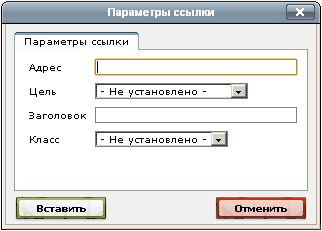

В поле "Адрес" введите адрес гиперссылки. В выпадающем списке "Цель" выберите, в каком окне будет открыта ссылка при клике посетителя по ней:

* в этом же окне — ссылка откроется в текущей вкладке (текущем окне);
* в новом окне — ссылка откроется в новой вкладке (новом окне).

В поле "Заголовок" можно ввести текст всплывающей подсказки.

Удалить гиперссылку
^^^^^^^^^^^^^^^^^^^

Удаляет гиперссылку. Установите курсор на текст ссылки и нажмите кнопку. При этом текст не удалится, но перестанет быть ссылкой.

Добавить / изменить якорь
^^^^^^^^^^^^^^^^^^^^^^^^^

При нажатии данной кнопки открывается диалог вставки якоря.

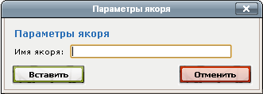

Якорь — специальная невидимая метка, позволяющая создать ссылку на конкретное место документа. Такая ссылка записывается в виде: ``http://имя_сайта/страница#имя_якоря``.

.. _upload:

Загрузка изображений
^^^^^^^^^^^^^^^^^^^^

При нажатии данной кнопки открывается диалог для вставки изображений. В левой части в виде дерева отображается список существующих директорий папки data.

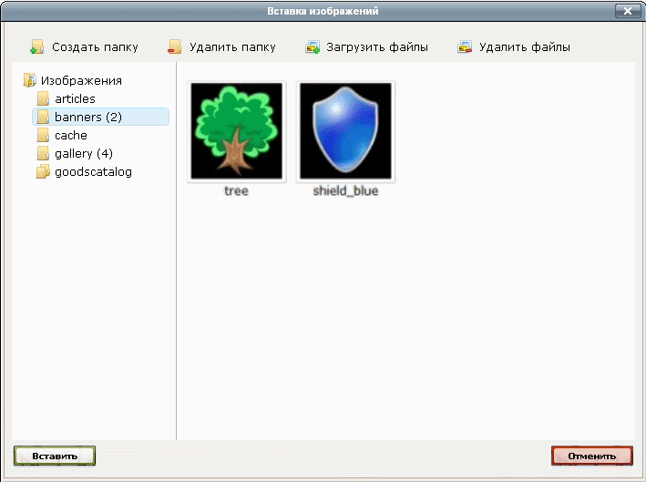

Для создания папки изображений следует выбрать родительскую директорию и нажать кнопку "Создать папку". Далее требуется указать имя создаваемой папки и подтвердить операцию нажатием кнопки "Создать" либо отменить — нажатием кнопки "Отменить создание".

.. image:: wysiwyg/wysiwyg-dialogs-image-files-dir.png

Для удаления папки следует выбрать требуемую директорию и нажать кнопку "Удалить папку". После этого в открывшемся диалоге следует подтвердить операцию удаления.

Для того чтобы загрузить изображение необходимо выбрать директорию и нажать кнопку "Загрузить файлы". При этом открывается диалог добавления изображений.

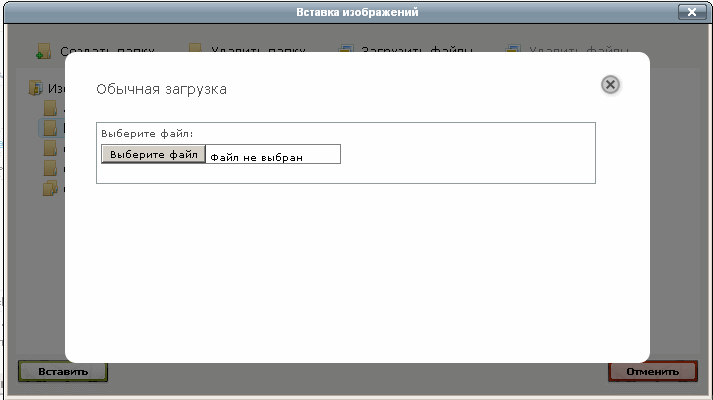

В появившемся окне "Обычная загрузка" необходимо нажать на кнопку "Выберите файл". При этом откроется стандартное окно проводника, в котором следует выбрать файл изображения и нажать кнопку "Открыть". В окне "Обычная загрузка" отобразится название загруженного файла изображения.

Таким образом можно загружать несколько изображений. После выбора файлов изображений необходимо нажать на кнопку "Загрузить". При этом список загруженных изображений попадает в выбранную папку.

Для удаления файлов следует выбрать требуемый файл и нажать кнопку "Удалить файл". После этого в открывшемся диалоге следует подтвердить операцию удаления.

Добавить / изменить изображение
^^^^^^^^^^^^^^^^^^^^^^^^^^^^^^^

При нажатии данной кнопки открывается диалог свойств изображения:

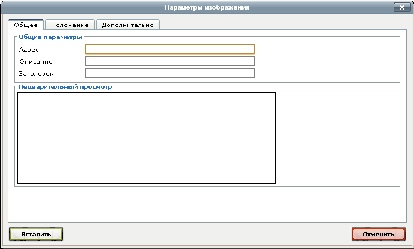

Данный диалог содержит следующие вкладки:

  * "Общие" — установка общих параметров изображения;
  * "Положение" — форматирование изображения: установка размеров и расположения рисунка;
  * "Дополнительно" — установка свойств для динамического изображения, а также для дополнительных параметров.

На вкладке "Общие" поля заполняются следующим образом:

  * В поле "Адрес" следует указать веб-адрес картинки. **Внимание!** Чтобы картинка была доступна посетителям сайта, она должна находиться в Интернете! Например, загружена на сайт при помощи кнопки :ref:`Загрузка изображений <upload>`.
  * В поле "Описание изображения" следует ввести альтернативный текст, который будет отображен вместо картинки, если отобразить изображение по каким-то причинам не удается (например пользователь отключил в своем браузере загрузку картинок).
  * В поле "Заголовок" можно указать текст, который будет отображаться при наведении курсора мыши на картинку (во всех браузерах, кроме Internet Explorer).
  * В поле "Просмотр" отображается редактируемое изображение.

Добавить черту
^^^^^^^^^^^^^^

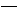

Добавить символ
^^^^^^^^^^^^^^^

При нажатии данной кнопки открывается диалог для выбора добавляемого символа из списка.

Добавление / изменение таблицы
^^^^^^^^^^^^^^^^^^^^^^^^^^^^^^

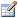

При нажатии данной кнопки вызывается диалог свойств добавляемой или изменяемой таблицы.

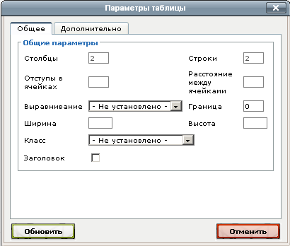

В диалоге следует установить значения в следующих полях:

  * "Строки" — количество строк в таблице;
  * "Столбцы" — количество столбцов в таблице.

При необходимости в данном диалоге также можно установить остальные параметры таблицы.

Для ввода заголовка таблицы следует установить галочку в поле "Заголовок". При этом над таблицей будет выделена специальная область для ввода заголовка.

Оформление шапки таблицы производится при установке параметров ячейки (см. ниже).

Параметры строки
^^^^^^^^^^^^^^^^

Кнопка используется для вызова диалога, в котором устанавливаются параметры выделенной строки таблицы. Для строки можно выбрать выравнивание, вертикальное выравнивание.

Параметры ячейки
^^^^^^^^^^^^^^^^

Кнопка используется для вызова диалога, в котором устанавливаются параметры выделенной ячейки таблицы.

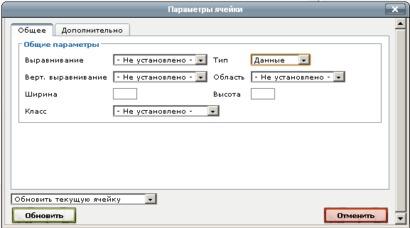

Для ячейки можно выбрать выравнивание, вертикальное выравнивание, ширину.

Также при помощи данного диалога можно оформить шапку таблицы. Для этого следует выбрать требуемые строки таблицы и нажать кнопку "Параметры ячейки". В открывшемся диалоге требуется в выпадающем списке "Тип" выбрать значение "Заголовок" и подтвердить редактирование нажатием кнопки "Обновить".

Добавить строку сверху
^^^^^^^^^^^^^^^^^^^^^^

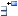

При нажатии данной кнопки добавляется строка перед строкой, где установлен курсор.

Добавить строку снизу
^^^^^^^^^^^^^^^^^^^^^

.. image:: wysiwyg/wysiwyg-buttons-insert-row-after.png

При нажатии данной кнопки добавляется строка после строки, где установлен курсор.

Удалить строку
^^^^^^^^^^^^^^

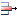

При нажатии данной кнопки удаляется строка, на которой установлен курсор.

Добавить столбец слева
^^^^^^^^^^^^^^^^^^^^^^

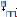

При нажатии данной кнопки добавляется столбец слева от столбца, где установлен курсор.

Добавить столбец справа
^^^^^^^^^^^^^^^^^^^^^^^

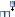

При нажатии данной кнопки добавляется столбец справа от столбца, где установлен курсор.

Удалить столбец
^^^^^^^^^^^^^^^

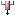

При нажатии данной кнопки удаляется столбец, на котором установлен курсор.

Разделить ячейки
^^^^^^^^^^^^^^^^

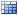

Объединить ячейки
^^^^^^^^^^^^^^^^^

Вырезать
^^^^^^^^

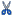

Работает только в Internet Explorer. Вырезает выделенный текст и помещает его в буфер обмена.

Копировать
^^^^^^^^^^

Работает только в Internet Explorer. Копирует выделенный текст в буфер обмена.

Вставить
^^^^^^^^

Работает только в Internet Explorer. Вставляет содержимое буфера обмена в текущую позицию курсора.

Вставить как текст
^^^^^^^^^^^^^^^^^^

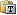

Для того чтобы текст, скопированный из офисных приложений или браузера, был вставлен из буфера обмена без форматирования, следует нажать данную кнопку и после этого вставить содержимое буфера обмена в текстовое поле (это можно сделать нажатием комбинаций клавиш ``Ctrl+V`` или ``Shift+Insert``). При этом в поле редактора будет вставлен текст очищенный от всех стилей и форматирования.

Вставить из Word
^^^^^^^^^^^^^^^^

Позволяет вставлять текст, скопированный из офисных приложений, таких как Word или Writer, с сохранением структуры, но без лишних стилей, которые могут испортить вид текста на веб-странице.

При нажатии данной кнопки будет вызван диалог, в который необходимо  вставить текст, скопированный из офисного приложения:

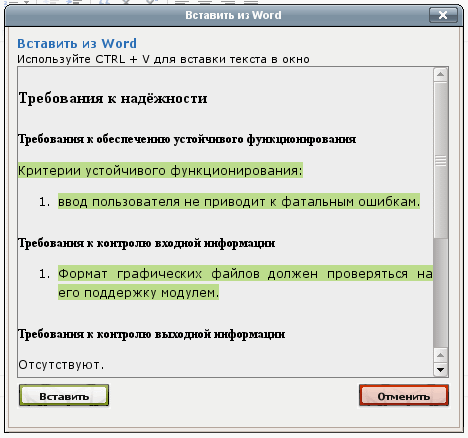

Нажмите "Вставить". При этом в текстовое поле будет вставлен структурированный текст.

Очистить лишний код
^^^^^^^^^^^^^^^^^^^

.. image:: wysiwyg/wysiwyg-buttons-cleancode.png

При нажатии данной кнопки из выделенного текста удаляются лишние теги и атрибуты, которые могут быть получены в результате копирования из текстовых редакторов типа Microsoft Word.

Редактировать HTML-код
^^^^^^^^^^^^^^^^^^^^^^

При нажатии данной кнопки открывается окно "Редактор HTML-кода", в котором можно просмотреть и отредактировать HTML-код, созданный визуальным редактором.

.. _statusbar:

Строка состояния
----------------

При установке курсора на каком-либо текстовом или графическом объекте в поле «Теги» будут отображены теги HTML, которые используются для данного объекта. Теги отображаются последовательно, от родительских к потомкам.

.. rubric:: Примечания

.. [#f1] при помощи тега <small>
