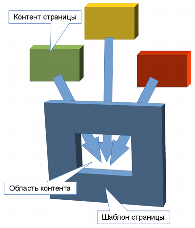

Шаблоны страниц
===============

.. note::
   Вообще, правильнее называть называть эти шаблоны шаблонами разделов, поскольку они задаются не для
   конкретной страницы, а для всего :doc:`раздела сайта<../manage/intro/terms>`.

Шаблон страницы --- это шаблон, описывающий всю страницу, за исключением области контента.

Обычно такой шаблон содержит:

* секцию <head> документа HTML;
* шапку и подвал страницы;
* боковые панели.

Область контента (т. е. место, куда будет подставлен контент страницы) задаётся свойством
``${page->content}``.

Пример простого шаблона:

.. code-block:: smarty

   <!-- Название шаблона, которое будет отображаться в АИ -->

   <!DOCTYPE html>
   <html>
   <head>
       <meta charset="UTF-8">
       <title>{$page->title} — {$site->title}</title>
       <meta name="keywords" content="{$site->keywords}">
       <meta name="description" content="{$site->description}">
       <link rel="stylesheet" href="{$site->webStyle}/default.css" media="all">
   </head>
   <body>
       <header>…</header>
       

           {$page->content}
       

       <footer>…</footer>
   </body>
   </html>
